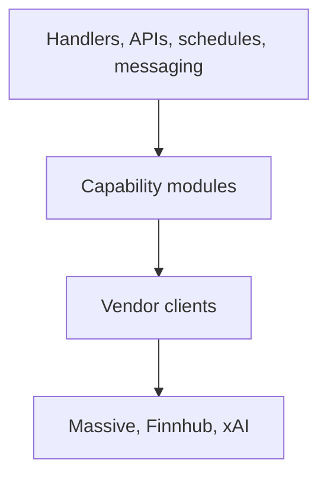

# Vendor Capability Split Plan

## Goal

Reorganize `src/lib/vendors` into a **transport-only** provider-client layer. Capabilities such as prices, bars, asset events, asset reference, company news, and AI summaries live in domain folders under `src/lib`.

Application code imports capability modules, not vendor endpoint modules, except for live-provider checks, DB scripts, and provider-specific tests.

## Boundary Rules (V2)

- `src/lib/vendors/**` may contain only:
  - `fetch.ts` — shared retry/timeout constants and test HTTP skip guard
  - `massive/client.ts` — Massive auth, URL building, retries, rate-limit handling
  - `finnhub/client.ts` — Finnhub auth, token redaction, retries
  - `grok/client.ts` — xAI Responses API transport only
- `src/lib/vendors/**` must **not** import from capability folders (`market-data`, `asset-events`, `assets`, `daily-digest`, `messaging`, `backfill`, etc.).
- Capability modules may import vendor clients and compose multiple providers behind neutral domain names.
- No compatibility barrels or long-lived re-export shims at old vendor paths.

## Target Shape

**Vendor clients (transport only):**

- `src/lib/vendors/fetch.ts`
- `src/lib/vendors/massive/client.ts`
- `src/lib/vendors/finnhub/client.ts`
- `src/lib/vendors/grok/client.ts`

**Capability modules:**

- `src/lib/market-data/` — types, session, bars, quotes/prices, sparklines, movers
- `src/lib/asset-events/` — types, earnings, corporate-actions, enrichment, providers facade
- `src/lib/assets/reference/` — universe, delistings, ticker-detail
- `src/lib/company-news/` — fetch and types
- `src/lib/daily-digest/` — digest extras and Grok sections
- `src/lib/ai/` — Grok citation helpers

## Allowed Direct Vendor Imports

- `src/handlers/live-provider-check.ts` — intentional live adapter probes
- `scripts/db/fetch-us-assets.ts` — admin/seed script
- `src/lib/time/market-calendar.ts` and low-level calendar/session helpers that need raw `marketDataFetch`
- `tests/lib/vendors/*` — vendor client unit tests only

## Validation

- `npm run check:ts`
- Targeted Vitest for moved capabilities and updated `vi.mock` paths
- Final smoke: `npm run check:biome`, `npm run check:ts`, relevant `npm test` subset
