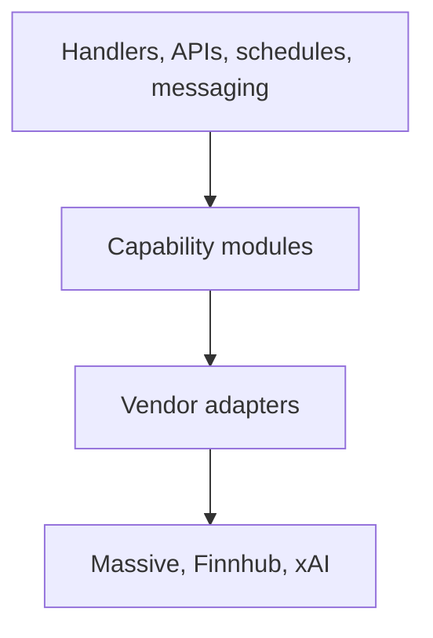

# Vendor Capability Split Plan

## Goal
Disruptively reorganize `src/lib/vendors` so it contains provider-specific adapter code only. Capabilities such as prices, company news, asset events, backfill, Grok summaries, retry policy, and sector mapping should live in domain folders under `src/lib`.

This is an internal breaking rewrite: old module paths should disappear, consumers should move to final capability imports, and the result should be easier to reason about than today’s mixed vendor bucket.

## Assumptions
- Module paths and exported symbol locations may change freely.
- Runtime behavior, SQS message schema, Lambda handlers, AWS resource names, and live-provider semantics should remain unchanged unless a small cleanup is needed to make the new boundary coherent.
- Do not add compatibility barrels or old-path re-export shims.
- Provider adapters expose raw vendor-shaped fetch/parsing functions.
- Application code imports capability modules, not provider modules, except for live-provider checks, DB scripts, and provider-specific tests.

## Boundary Rules
- `src/lib/vendors/**` may depend on shared infra (`db/env`, logging, vendor HTTP policy) and vendor-local helpers only.
- `src/lib/vendors/**` must not import from capability folders such as `market-data`, `asset-events`, `daily-digest`, `messaging`, `backfill`, or `market-notifications`.
- Capability modules may import vendor adapters and compose multiple vendors behind domain names.
- Tests should mirror the provider/capability split instead of treating `tests/lib/vendors/*` as the default home.

## Target Shape

Provider adapters:
- `src/lib/vendors/massive/client.ts`: `marketDataFetch` and Massive auth/retry mechanics.
- `src/lib/vendors/massive/aggregates.ts`: bars, daily closes, OHLCV, intraday candles, previous close/bar parsing.
- `src/lib/vendors/massive/snapshot.ts`: snapshot quote parsing and `NO_SESSION_TRADE`.
- `src/lib/vendors/massive/reference.ts`: active tickers, ticker detail, ticker references, dividends, splits, IPOs.
- `src/lib/vendors/massive/news.ts`: Massive company-news endpoint adapter.
- `src/lib/vendors/massive/movers.ts`: top movers adapter.
- `src/lib/vendors/finnhub/client.ts`: `finnhubFetch` and Finnhub auth/retry mechanics.
- `src/lib/vendors/finnhub/earnings.ts`: earnings calendar and cache.
- `src/lib/vendors/finnhub/analyst.ts`: recommendation trends.
- `src/lib/vendors/finnhub/insider.ts`: insider transactions.
- `src/lib/vendors/grok/client.ts`: xAI/Grok Responses API transport only.

Capability/domain modules:
- `src/lib/market-data/types.ts`: `MarketSession`, `AssetPriceMap`, `ExtendedQuoteMap`, `ExtendedAssetQuote`, `NoSessionTrade`.
- `src/lib/market-data/session.ts`: `parseMarketSession`, `getCurrentMarketSession`.
- `src/lib/market-data/prices.ts`: `fetchAssetPrices`, `fetchAssetPricesWithSessionState`, `fetchExtendedQuotes`, `fillSnapshotMissesWithPrevDayBar`.
- `src/lib/market-data/sparklines.ts`: `fetchSparklines`, `fetchIntradaySparklines`.
- `src/lib/company-news/types.ts` and `src/lib/company-news/fetch.ts`: `CompanyNewsItem`, `fetchCompanyNews`.
- `src/lib/backfill/queue.ts`: current `vendors/queue.ts` SQS enqueue/process logic.
- `src/lib/resilience/optional-vendors.ts`: optional vendor circuit/budget state and skip counters.
- `src/lib/schedule/retry-delays.ts`: `computeDeliveryRetryDelayMs`.
- `src/lib/assets/sector-mapping.ts`: `SECTOR_ETF_MAP`, `sicCodeToSector`.
- `src/lib/asset-events/providers.ts`: earnings/dividends/splits/IPOs facade backed by Finnhub and Massive adapters.
- `src/lib/asset-events/format.ts`: `formatAssetEventsSection`, `formatAnalystSection`, `formatInsiderSection`.
- `src/lib/daily-digest/finnhub-extras.ts`: `fetchFinnhubExtras`, `buildNewsContextForGrok`.
- `src/lib/daily-digest/grok-sections.ts`: `generateNewsWithGrok`, `generateRumorsWithGrok`, `GrokSectionResult`.
- `src/lib/ai/grok-citations.ts`: `applyAnnotationsInline`, `isXUrl`, `linkLabelFromUrl`, `XaiAnnotation`.

## Migration Strategy

Build the new shape directly and remove old files as their consumers move. The phases are ordered to keep the work reviewable, but each phase should cut over fully instead of leaving compatibility layers behind.

1. Move obvious non-vendor modules and delete old paths:
   - Move `src/lib/backfill/queue.ts` to `src/lib/backfill/queue.ts`.
   - Move `src/lib/assets/sector-mapping.ts` to `src/lib/assets/sector-mapping.ts`.
   - Split `src/lib/resilience/optional-vendors.ts` into `src/lib/resilience/optional-vendors.ts` and `src/lib/schedule/retry-delays.ts`.
   - Move related tests into domain-oriented test folders.

2. Replace `price-fetcher` with `market-data`:
   - Create `src/lib/market-data/types.ts`, `session.ts`, `prices.ts`, and `sparklines.ts`.
   - Update all consumers from `../vendors/price-fetcher` to specific capability modules.
   - Break the type cycle between `price-fetcher.ts` and `market-notifications/price-history-cache.ts`.
   - Move tests to `tests/lib/market-data/*`.
   - Delete `src/lib/vendors/price-fetcher.ts`.

3. Delete monolithic `massive.ts`:
   - Move `marketDataFetch` to `vendors/massive/client.ts`.
   - Move snapshot, aggregate, reference, news, and mover endpoint code into provider files.
   - Move `formatAssetEventsSection` to `asset-events/format.ts`.
   - Move Finnhub earnings out of `massive.ts` into `vendors/finnhub/earnings.ts` and expose it through `asset-events/providers.ts`.
   - Update consumers and tests to final paths.

4. Delete monolithic `finnhub.ts` and vendor-placed company news:
   - Keep low-level fetch and endpoint parsing in `vendors/finnhub/*`.
   - Move batch digest orchestration to `daily-digest/finnhub-extras.ts`.
   - Move analyst/insider formatting into `asset-events/format.ts`.
   - Move company news into `company-news`.
   - Delete `src/lib/vendors/finnhub.ts` and `src/lib/vendors/company-news.ts`.

5. Delete monolithic `grok.ts`:
   - Keep xAI Responses API request code in `vendors/grok/client.ts`.
   - Move citation/link helpers to `ai/grok-citations.ts`.
   - Move daily-digest prompts and section generation to `daily-digest/grok-sections.ts`.
   - Keep `market-notifications/grok-summary.ts` as the price-alert capability, updated to depend on shared AI helpers.

6. Update tests and docs after each phase:
   - Update hard-coded Vitest mock paths in `tests/setup.ts` and direct `vi.mock(...)` calls.
   - Rename tests based on what they test: provider adapter vs capability.
   - Update `docs/external-apis.md` and existing plan/spec references.
   - Treat any remaining application import from `src/lib/vendors/**` as suspicious unless it is truly provider-facing.

## Validation
Run targeted checks after each phase, then broader checks at the end. Adjust test paths as files move.

- `npm run check:ts`
- `npm test -- tests/lib/market-data/get-current-market-session.test.ts tests/lib/market-data/intraday-sparklines.test.ts tests/lib/market-data/fill-snapshot-misses.test.ts`
- `npm test -- tests/lib/vendors/massive.test.ts tests/lib/vendors/massive-snapshot-quotes.test.ts tests/lib/vendors/massive-top-movers.test.ts`
- `npm test -- tests/lib/company-news/fetch.test.ts tests/lib/daily-digest/finnhub-extras.test.ts tests/lib/asset-events/fetch.test.ts`
- `npm test -- tests/lib/backfill/queue.test.ts tests/lib/resilience/optional-vendors.test.ts tests/lib/schedule/helpers.test.ts`
- Final smoke: `npm run check:biome`, `npm run check:ts`, and the relevant full `npm test` subset if local Supabase is healthy.

## Risks
- `price-fetcher` has the largest consumer fan-out and several global test mocks; replace it in one focused phase rather than dragging a compatibility module forward.
- `massive.ts`, `finnhub.ts`, and `company-news.ts` currently form a dependency chain. Splitting clients first prevents circular imports from moving into the new structure.
- `marketDataFetch` is used by `scripts/db/fetch-us-assets.ts` and `time/market-calendar.ts`; those should import the Massive client directly, while product features should prefer capability modules.
- The SQS backfill message schema is a contract. Move files, not message shapes.
- Stale `vi.mock(...)` paths are the most likely test failure mode; prioritize targeted tests for mocked modules after each move.
