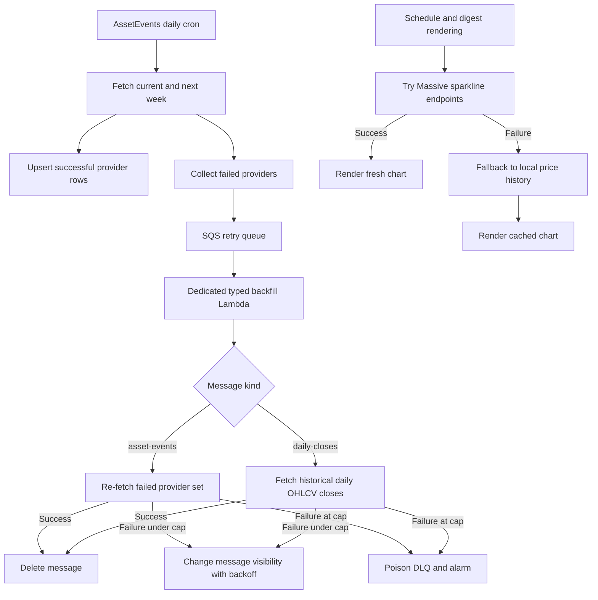

# Asset Events Backfill DLQ Plan

**Spec:** Inline in this plan. Goal: make critical asset-events ingest failures recover automatically, and make notification sparklines resilient to runtime provider chart failures without coupling that behavior to notification delivery retries.

## Recommendation

Use an AWS SQS work queue plus a poison DLQ as the durable backfill ledger for reconstructible provider data. The asset-events daily cron enqueues failed `{weekStart, weekEnd, providers}` items after partial provider failures. The compute-daily-stats job enqueues failed daily-close cache ranges because historical daily OHLCV can be fetched later. A dedicated typed backfill Lambda is triggered from SQS, routes each message by `kind`, and uses visibility-timeout backoff plus a five-attempt redrive cap so bad items stop looping and land in the DLQ/alarm path.

Keep `scheduled_notifications` separate. It is delivery state with duplicate-send protections, channel status, and audit rows; moving it into SQS would still require the DB state machine. Unify retry policy and observability, not the storage mechanism.

Add a separate price-history fallback for sparklines. This is not DLQ/backfill work: sparklines are optional presentation enrichment generated at notification time. Store local price history so chart rendering can try Massive first, then fall back to recent local data when Massive chart endpoints fail.

Treat daily closes differently from live minute prices. Missing daily closes are worse because cached 7-day charts require seven closes, and daily OHLCV is historical/reconstructible. Missing minute-level live quotes remain best-effort in v1: retry store failures where we already have captured rows, but do not add historical minute-bar gap repair yet.

Cache symbols should include user-tracked assets plus benchmark/context symbols used by price alerts, currently SPY and needed sector ETFs. The schema must handle benchmark symbols that may not be ordinary user-tracked assets.

## Current Anchors

- Asset-events daily ingest lives in `src/handlers/asset-events.ts` and already collects `failedProviders` per week.
- Provider fetch and partial failure behavior lives in `src/lib/asset-events/fetch.ts`. It is already idempotent because successful rows are upserted.
- The backfill consumer should be a dedicated Lambda, not the notification heartbeat in `src/lib/schedule/run.ts`, so vendor retry work cannot delay ordinary SMS/email delivery.
- The same typed backfill queue should handle both asset-events ingest repair and daily-close cache repair, with one DLQ/alarm path.
- Backoff can reuse `computeDeliveryRetryDelayMs()` from `src/lib/providers/vendor-fault-tolerance.ts`, currently 5m, 15m, 30m, then 60m.
- Recent quote snapshots already exist in `src/lib/market-notifications/snapshot-store.ts`, but retention is only 60 minutes, sparkline rendering does not currently read from it, and it is coupled to anomaly detection. Sparkline fallback should use dedicated cache tables instead.
- Runtime sparklines are generated in `src/lib/providers/price-fetcher.ts` via `fetchSparklines()` and `fetchIntradaySparklines()`.

## Target Flow

## Implementation Shape

Implement as three phases in one plan. Phase 3 is first because delivery-state bugs can consume user-facing notification slots today. Phase 1 ships durable typed SQS backfill for reconstructible provider data. Phase 2 ships local price-history fallback for sparklines. Pause after each phase for review and focused verification before moving to the next phase.

### Phase 1: Typed SQS Backfill

1. Add SQS infrastructure in `aws/template.yaml`:
   - A typed backfill queue, e.g. `VendorBackfillQueue`, with `VisibilityTimeout` long enough for one provider/week or daily-close retry and a `RedrivePolicy` to a DLQ.
   - A poison DLQ, e.g. `VendorBackfillDLQ`, with 14-day retention.
   - `VendorBackfillFunction`, a small SQS-triggered Lambda using the same Node 24/SAM esbuild conventions as the existing handlers.
   - Event source mapping from retry queue to backfill Lambda with low batch size, partial batch item failure support, and `maxReceiveCount: 5`.
   - IAM/env vars: asset-events and compute-daily-stats Lambdas can `SendMessage`; backfill Lambda can read/delete/change visibility on the queue and use the same Supabase/vendor env vars needed by `fetchAndStoreAssetEvents` and daily OHLCV fetching.
   - Add a CloudWatch alarm on DLQ visible messages `>= 1` to the existing alert topic.

2. Add a typed backfill helper, likely `src/lib/vendor-backfill/queue.ts`, plus asset-events and daily-close handlers:
   - Define message schemas with a `kind` discriminator.
   - `kind: "asset-events"` includes `weekStart`, `weekEnd`, `providers`, and `reason`.
   - `kind: "daily-closes"` includes `symbols`, `from`, `to`, and `reason`.
   - `kind: "price-history-store"` includes already-captured minute price rows and original `captured_at` timestamps for retrying DB store failures without refetching live quotes.
   - `kind: "new-symbol-warmup"` includes a newly tracked symbol and triggers asset-events plus daily-close warmup work.
   - `enqueueAssetEventsIngestRetry()` sends one message per failed week with the provider list from `failedProviders`.
   - `enqueueDailyCloseBackfill()` sends a message when `compute-daily-stats` fails to fetch/store daily close cache data for symbols in its lookback.
   - `enqueuePriceHistoryStoreRetry()` sends a message when live quote fetch succeeds but inserting `asset_price_history` rows fails.
   - `enqueueNewSymbolWarmup()` sends a message when a user adds a new tracked symbol so near-term asset-events and 7-day daily-close fallback data do not have to wait for the next scheduled jobs.
   - `handleVendorBackfillBatch()` validates each SQS record, routes by `kind`, and returns partial batch failures for records that should remain on the queue.
   - Use the SQS `ApproximateReceiveCount` attribute to choose backoff: 5m, 15m, 30m, 60m, 60m.
   - On failure under the five-attempt cap, call `ChangeMessageVisibility` to the computed backoff and report the record as failed.
   - On terminal failure, log an error and report failure so SQS redrive moves the record to the DLQ.

3. Make retries targeted but keep code simple in `src/lib/asset-events/fetch.ts`:
   - Add an optional `providers` filter for `earnings`, `dividends`, `splits`, and `ipos`.
   - Default remains today’s behavior: fetch all providers.
   - Retry drain passes only failed providers, reducing load and avoiding unnecessary Massive/Finnhub calls.

4. Wire enqueue after daily ingest in `src/handlers/asset-events.ts`:
   - After the existing `results` array is populated, enqueue each week that has `failedProviders.length > 0`.
   - Keep the existing error log and alarm behavior.
   - If SQS enqueue fails, log an error but do not fail the whole Lambda; the alarm already tells us ingest degraded.

5. Add the SQS entrypoint in a new handler, likely `src/handlers/vendor-backfill.ts`:
   - Parse SQS records and delegate to `handleVendorBackfillBatch()`.
   - Return `batchItemFailures` so one bad message does not cause successful messages to repeat.
   - Keep this handler focused on reconstructible provider data: critical calendar ingest and daily closes. No optional enrichment, delisting sweep, or historical minute-gap repair.

### Phase 2: Price-History Sparkline Fallback

1. Add local price-history fallback for sparklines:
   - Create a dedicated `asset_price_history` cache table for minute snapshots retained for 36 hours. This table should allow benchmark/sector symbols without requiring an `assets` FK.
   - Create a dedicated `asset_daily_closes` cache table for daily closes retained for 30 days. This table should also be benchmark-safe.
   - Capture minute snapshots for tracked assets plus benchmark/sector context symbols during active sessions: pre-market, regular, and after-hours.
   - Integrate active-session snapshot capture into the existing schedule run, reusing fetched quote maps when possible and fetching any missing tracked+benchmark symbols once per minute.
   - Populate the daily close cache from `src/handlers/compute-daily-stats.ts`, which already fetches daily OHLCV bars. Include tracked assets plus SPY/needed sector ETFs so benchmark fallback charts are warm too.
   - When daily close cache fetch/store fails, enqueue `kind: "daily-closes"` backfill work instead of leaving the 7-day fallback cache permanently incomplete.
   - Add helper functions in or near `src/lib/market-notifications/snapshot-store.ts` to build an intraday sparkline from recent local snapshots.
   - Add helper functions in or near `src/lib/providers/price-fetcher.ts` to build 7-day sparklines from cached daily closes.
   - Keep runtime behavior provider-first: `fetchSparklines()` and `fetchIntradaySparklines()` try Massive first, then use the cache if Massive fails or returns insufficient data.
   - When fallback data is used, render a subtle user-facing timestamp label such as `chart as of 9:42 AM EDT` rather than silently implying provider-fresh data.
   - Format the fallback timestamp in the user's notification timezone and include a timezone label. Respect `use_24_hour_time` when choosing 12h/24h formatting.
   - Use cached intraday charts only when the latest cached point is no more than 15 minutes old; otherwise omit the chart.
   - Use cached 7-day charts only when the cache has seven daily closes for the symbol; otherwise omit the 7-day fallback chart.

### Phase 3: Delivery-State Reliability Fixes

1. Fix scheduled market update retry advancement:
   - Update `src/lib/market-notifications/scheduled/process.ts` so `market_scheduled_asset_price_next_send_at` advances only when enabled delivery channels are terminal for the scheduled slot.
   - Mirror the daily digest pattern from `src/lib/daily-digest/schedule-state.ts`: sent channels, opted-out/disabled channels, and retries-exhausted channels are terminal; failed channels with future `scheduled_notifications.next_retry_at` are not.
   - Require all enabled channels to be terminal before advancing `next_send_at`.
   - Add a focused helper near the scheduled market code rather than overloading daily digest helpers with market-specific semantics.
   - Add tests proving a failed email/SMS attempt keeps the user due for same-slot retry, while successful/terminal channels advance to the next configured send time.

2. Fix standalone asset-events retry advancement:
   - Update `src/lib/asset-events/process.ts` so `asset_events_next_send_at` advances only when enabled asset-events delivery channels are terminal for the scheduled slot.
   - Require all enabled channels to be terminal before advancing `next_send_at`.
   - Preserve current skip behavior for users with no asset-events options or no delivery channels.
   - Add tests proving delivery failures remain retryable via `scheduled_notifications`, and terminal/success states advance the schedule.

3. Fix price target delivery/state ordering:
   - Update `src/lib/price-targets/process.ts` so a triggered target is not deleted until at least one enabled channel successfully delivers or the target is intentionally marked terminal.
   - If delivery fails for all enabled channels, persist a pending-triggered state with the hit price/time and retry delivery without re-evaluating the threshold.
   - Add tests for email-only, SMS-only, both-channel partial success, and all-channel failure.

4. Fix price alert and flat alert state/cooldown ordering:

- Audit `src/lib/market-notifications/process.ts` and `src/lib/market-notifications/flat-alerts/process.ts` for state updates that happen before delivery is known to be successful.
- For anomaly price alerts, replace permanent pre-delivery cooldown claiming with reserve/finalize semantics.
- Reserve the user/symbol/trading-day slot before delivery to block overlapping cron ticks from sending duplicates.
- Finalize the reservation only after at least one enabled channel succeeds, preserving the one-alert-per-user-symbol-trading-day cooldown.
- If all enabled delivery channels fail, release/reset the reservation so a later tick can retry instead of consuming the user's only daily anomaly alert.
- If a process crashes while a reservation is `sending`/`reserved`, allow stale reservation reclaim after a timeout, matching the `scheduled_notifications` stale `sending` pattern.
- For flat price alerts, commit baseline/state only after at least one enabled channel succeeds, or persist a pending state that is retried without losing the trigger.
- Use reserve/finalize semantics for flat price alerts too: reserve before delivery to prevent overlapping duplicate sends, finalize baseline after at least one enabled channel succeeds, and release/reset on all-channel failure.
- Add tests that simulate enrichment failure, SES/Twilio failure, and partial delivery success.

1. Fix staged daily digest retry retention:

- Update staged notification purge logic in `src/lib/staged-notifications/db.ts` or the relevant staged-notification cleanup path so rows under retry backoff are not purged only because `staged_at` is older than 5 minutes.
- Use retry-aware purge semantics: keep staged rows while they are still retryable, and purge once delivered/terminal or once the user's next scheduled daily slot supersedes them.
- Ensure outer exceptions in staged delivery reschedule or otherwise leave a retryable row instead of just logging and skipping.
- Add tests for a staged row rescheduled to 15m/30m/60m backoff surviving purge, while truly stale terminal rows are still removed.

1. Add focused tests:

- New `tests/lib/vendor-backfill/queue.test.ts`: message validation, routing by `kind`, success delete, visibility backoff, partial batch failure response, terminal attempt behavior.
- Update `tests/lib/asset-events/fetch.test.ts`: provider-filtered fetch retries only requested providers and still upserts idempotently.
- Add handler coverage for `src/handlers/vendor-backfill.ts`.
- Add snapshot/cache tests for 36h retention, active-session capture, intraday fallback, daily close fallback, and provider-first behavior.
- Add delivery-state tests for scheduled market, standalone asset-events, price targets, price alerts, flat alerts, and staged notification purge behavior.

## Guardrails

- Do not use this path for optional Finnhub enrichment or delisting sweep failures in the first iteration; keep scope to critical calendar ingest providers: `earnings`, `dividends`, `splits`, `ipos`.
- Do not use the schedule heartbeat for ingest backfill; keep notification delivery isolated from vendor retry work.
- Do not move `scheduled_notifications` into SQS. Keep DB-backed delivery retries and share retry constants/terminal logging conventions instead.
- Do not store every-minute prices for 7 days in the first iteration. Use 36h minute snapshots plus 30d daily closes.
- Do not add historical minute-bar gap repair in v1. Minute price capture is best-effort except for store failures where captured rows are already available.
- Do retry minute price-history store failures through the typed SQS queue when captured rows are already available; preserve original `captured_at`.
- Do treat daily closes as durable/backfillable because historical daily OHLCV can be fetched later and missing closes break 7-day fallback charts.
- Do enqueue new-symbol warmup work for asset-events and daily closes when a user starts tracking a symbol.
- Do not reuse or broaden `asset_snapshots` for sparkline fallback. Keep anomaly detection snapshots separate from cache-owned price history.
- Do not assume cached symbols all have `assets` rows. The new cache tables should accept benchmark/sector ETF symbols directly.
- Do not make sparkline failure block notification delivery. Cached charts are a graceful fallback; if both provider and cache miss, send without charts.
- Do not let retry bookkeeping consume user-facing notification slots before delivery is terminal. Schedule advancement, cooldown claims, target deletion, and flat-alert baselines must align with actual delivery outcome.
- Do not solve delivery-state bugs by moving `scheduled_notifications` into SQS. These are state-machine fixes, not provider backfill work.
- Accept duplicate messages in v1. `asset_events` and `market_events` upserts make duplicate retries safe, and avoiding FIFO keeps the AWS config smaller.

## Verification

Run the focused unit tests first, then repo checks:

- `npm test -- tests/lib/vendor-backfill/queue.test.ts tests/lib/asset-events/fetch.test.ts`
- `npm test -- tests/lib/market-notifications/snapshot-store.test.ts tests/lib/providers/price-fetcher.test.ts`
- `npm test -- tests/lib/market-notifications/scheduled/process.test.ts tests/lib/asset-events/process.test.ts tests/lib/price-targets/process.test.ts`
- `npm test -- tests/lib/market-notifications/flat-alerts/process.test.ts tests/lib/staged-notifications/deliver.test.ts`
- `npm run check:ts`
- `npm run check:biome`
- `npm run build`
- If SAM is available: `sam validate --template-file aws/template.yaml`

## Residual Risks

SQS retries recover failed calendar ingest and daily-close cache gaps quickly, but repeated provider outages can still push messages to the DLQ and require operator attention. Local price-history fallback makes charts more resilient, but it also increases write volume and table churn; retention and active-session-only capture keep that bounded. Minute-level gaps may still exist in v1 after live quote fetch outages, but daily close gaps should be backfillable.
