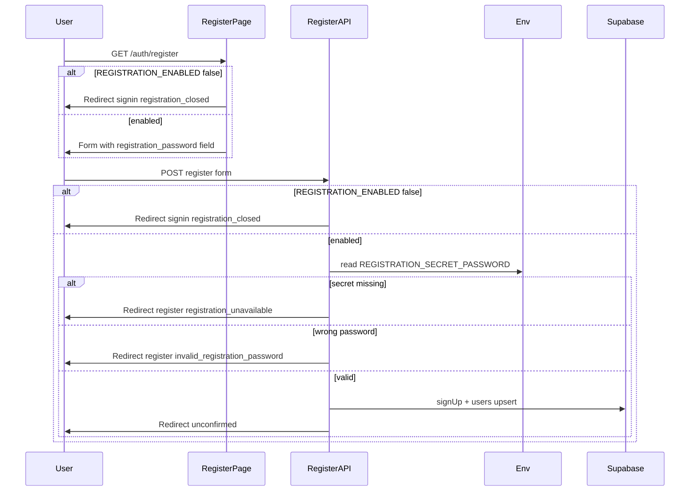

# Secret registration password

**Status:** Approved

**Date:** 2026-06-03

## Summary

Reintroduce public account registration behind a shared **registration password**
that only invited users receive. The password is stored server-side as an
environment variable and validated on the register API before Supabase
`signUp`. The register page instructs visitors to DM `@_jsolly` on X for the
password, matching the informal access model used on
[blogthedata.com/register](https://www.blogthedata.com/register/).

The existing `REGISTRATION_ENABLED` flag remains the product switch for whether
registration routes and marketing CTAs are visible. The secret env var is a
second gate: registration can be “open” in code while still requiring the
password at submit time.

## Problem

Registration is currently disabled application-wide via `REGISTRATION_ENABLED =
false` in `src/lib/constants.ts`. Both `/auth/register` and
`/api/auth/email/register` redirect to sign-in with `registration_closed`, and
landing/navigation copy hides register CTAs.

The product owner wants to allow new accounts again, but only for people who
receive a shared password out of band (e.g. via X DM), not for fully open
public signup.

## Goals

- Show `/auth/register` and register CTAs when `REGISTRATION_ENABLED` is `true`.
- Require a registration password on the register form before creating an auth
  user.
- Validate the password only on the server; never expose the expected value to
  the client.
- Display clear public copy: “Want access? DM @_jsolly on X for the registration
  password.”
- Preserve the existing registration pipeline after the secret passes: email
  validation, password rules, timezone resolution, Supabase signup, `users`
  profile upsert, orphan cleanup, redirect to `/auth/unconfirmed`, and email
  confirmation before sign-in.
- Fail closed when registration is enabled but the secret env var is missing or
  blank.

## Non-goals

- Per-user invite codes or a database table of revocable codes.
- Rate limiting specific to registration password attempts (reuse existing auth
  patterns only if already present; no new rate-limit subsystem for v1).
- Changing Supabase Auth project settings (signup remains allowed at the provider;
  gating stays in the app).
- Admin UI to rotate or view the registration password.
- Exposing whether the server misconfigured the secret vs. a wrong user guess in
  a way that aids enumeration beyond a single user-safe message for each case.

## Decisions

- **Two-layer gate:** `REGISTRATION_ENABLED` (code constant) plus
  `REGISTRATION_SECRET_PASSWORD` (env var). Do not replace the flag with “env
  var present means open.”
- **Env var name:** `REGISTRATION_SECRET_PASSWORD`, read via `readEnv()` /
  `requireEnv()` from `src/lib/db/env.ts` at point-of-use in the register API
  (and any shared helper the implementation introduces).
- **Comparison:** Exact match after trimming leading/trailing whitespace on the
  submitted field only. No case-folding unless we explicitly add it later.
- **Field name:** `registration_password` in the POST body, parsed like other
  register form fields.
- **User-facing label:** “Registration password” on the register page.
- **Wrong secret:** Redirect to `/auth/register?error=invalid_registration_password`
  with allowlisted message “Registration password is incorrect.” Do not call
  `signUp`.
- **Missing secret env:** When `REGISTRATION_ENABLED` is true but
  `REGISTRATION_SECRET_PASSWORD` is unset or blank, redirect to
  `/auth/register?error=registration_unavailable` with allowlisted message
  “Registration is temporarily unavailable. Please try again later.” Log at
  error level server-side.
- **Registration closed:** Unchanged — redirect to
  `/auth/signin?error=registration_closed` when `REGISTRATION_ENABLED` is false.

## User experience

### Register page (`src/pages/auth/register.astro`)

When `REGISTRATION_ENABLED` is true:

1. Page renders as today (email, password, confirm, optional timezone).
2. Add an informational line above the registration password field:
   **“Want access? DM @_jsolly on X for the registration password.”**
3. Add a required **Registration password** field at the top of the account
   fieldset (before email), with `autocomplete="off"` and no placeholder that
   hints at the secret.
4. Submit still posts to `/api/auth/email/register`.
5. Errors continue to use `StatusMessage` and `formatMessage` allowlist keys.

When `REGISTRATION_ENABLED` is false, behavior is unchanged (redirect to sign-in).

### Marketing and navigation

When flipping `REGISTRATION_ENABLED` to `true` for launch, existing components
already show register links (`Hero`, `Navigation`, `CTA`, `SignInCard`, FAQ).
No copy change required beyond the register page instruction unless FAQ should
mention DM-for-password; **v1 leaves FAQ as generic “create an account”** unless
product asks for FAQ updates in implementation.

## Server behavior

### Register API (`src/pages/api/auth/email/register.ts`)

Order of checks:

1. If `!REGISTRATION_ENABLED` → redirect `registration_closed` (unchanged).
2. Parse form including `registration_password` (required string).
3. Load `REGISTRATION_SECRET_PASSWORD` via env helper:
   - If missing/blank → log error, redirect `registration_unavailable`.
4. Compare trimmed submitted value to env value:
   - If mismatch → log info (no secret values in logs), redirect
     `invalid_registration_password`.
5. Continue existing flow: password length/match, timezone, `signUp`, profile
   upsert, redirects.

The registration password must be validated **before** `supabase.auth.signUp()`
so failed attempts do not create auth users.

### Configuration

| Variable | Where set | Purpose |
| --- | --- | --- |
| `REGISTRATION_ENABLED` | `src/lib/constants.ts` | Code-level on/off for routes and UI |
| `REGISTRATION_SECRET_PASSWORD` | `.env.local`, Vercel, etc. | Shared password required at signup |

Document `REGISTRATION_SECRET_PASSWORD` in `docs/tooling-setup.md` alongside
other deployment env vars.

## Data flow

## Messages

Add to `MESSAGE_ALLOWLIST` in `src/lib/constants.ts`:

| Key | User-facing text |
| --- | --- |
| `invalid_registration_password` | Registration password is incorrect. |
| `registration_unavailable` | Registration is temporarily unavailable. Please try again later. |

Existing `registration_closed` remains unchanged.

## Testing

### API (`tests/api/auth/email/register.test.ts`, security tests)

- Mock `REGISTRATION_ENABLED: true` (existing pattern).
- Set `REGISTRATION_SECRET_PASSWORD` in test env (or vi.stubEnv) for happy path;
  include `registration_password` in POST body matching the secret.
- Wrong password: 302 to `/auth/register?error=invalid_registration_password`,
  no auth user created.
- Missing env secret (stub unset): 302 to
  `/auth/register?error=registration_unavailable`, no auth user created.
- `REGISTRATION_ENABLED: false`: still redirects `registration_closed` (new test
  if not present).

### Page render (`tests/pages/pages-render.test.ts`)

- When registration enabled (mocked), register page HTML includes DM copy and
  registration password field label/input name.

### E2E (`tests/e2e/sanity.e2e.spec.ts`)

- When registration enabled, registration flow fills registration password from
  test env (document in test helpers / `.env.local` for E2E).
- When disabled, existing skip path unchanged.

## Acceptance criteria

- [ ] With `REGISTRATION_ENABLED = true` and valid `REGISTRATION_SECRET_PASSWORD`
  in env, a visitor can complete register → unconfirmed → verify → sign-in.
- [ ] Wrong registration password never creates a Supabase auth user.
- [ ] Missing `REGISTRATION_SECRET_PASSWORD` while registration enabled shows
  `registration_unavailable` and does not create users.
- [ ] With `REGISTRATION_ENABLED = false`, register page and API still reject
  with `registration_closed`.
- [ ] Register page shows the approved DM @_jsolly copy and required password
  field.
- [ ] Secret value never appears in client bundles, HTML, or logs.

## Alternatives considered

| Approach | Why not chosen |
| --- | --- |
| Env var only (no `REGISTRATION_ENABLED`) | Hides deploy intent; harder to grep “is signup open” |
| Database invite codes | More moving parts than shared password for v1 |
| Client-side secret check | Secret would leak; must stay server-only |

## Open questions

None for v1. FAQ copy mentioning DM-for-password can be a follow-up if support
volume warrants it.
